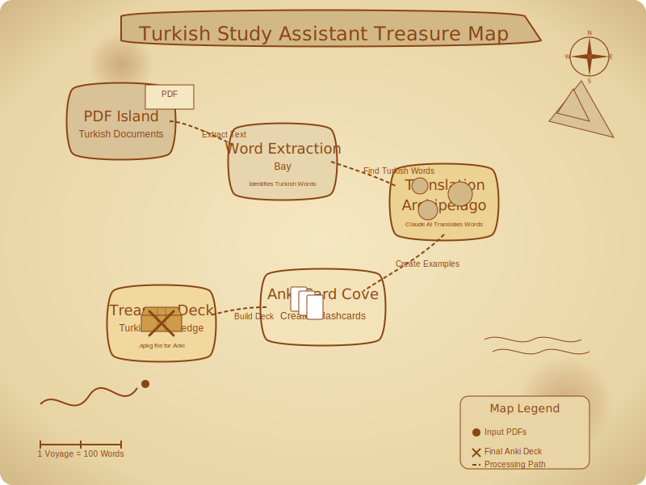
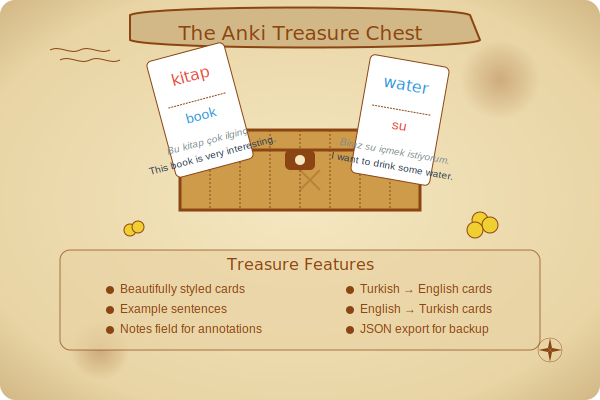

# Turkish Study Assistant


A Python tool to automatically create Anki flashcards from Turkish PDF documents by extracting words, translating them, and generating example sentences.

<div align="center">
  
</div>

## 🚀 Features

- Extract Turkish vocabulary from PDF documents
- Distinguish between Turkish and English text
- Translate Turkish words to English using Claude AI
- Generate example sentences for each word
- Create ready-to-import Anki flashcards
- Supports both Turkish→English and English→Turkish card formats

## 📋 Requirements

- Python 3.6 or higher
- PyMuPDF (`pip install pymupdf`)
- Anthropic Python SDK (`pip install anthropic`)
- genanki (`pip install genanki`)
- An Anthropic API key for Claude

## 💻 Installation

```bash
# Clone the repository
git clone https://github.com/yourusername/turkish-study-assistant.git
cd turkish-study-assistant

# Install required packages
pip install pymupdf anthropic genanki
```

## 🔧 Usage

### Processing PDFs and Creating Collections

```bash
# Process a single PDF file
./turkish_anki_generator.py process path/to/turkish_document.pdf --api-key YOUR_API_KEY

# Process a directory of PDFs into a named collection
./turkish_anki_generator.py process path/to/pdf_directory/ --collection turkish_a1 --api-key YOUR_API_KEY

# Add a description to your collection
./turkish_anki_generator.py process path/to/pdf_directory/ --collection turkish_a1 --description "A1 Level Turkish Vocabulary" --api-key YOUR_API_KEY

# Add new PDFs to an existing collection
./turkish_anki_generator.py process path/to/new_pdf.pdf --collection turkish_a1 --api-key YOUR_API_KEY

# Exclude words that are already in an existing Anki deck
./turkish_anki_generator.py process path/to/intermediate_pdfs/ --collection turkish_a2 --exclude-from output/turkish_a1/anki/Turkish_Vocabulary_*.apkg --api-key YOUR_API_KEY

# Set the API key as an environment variable instead
export ANTHROPIC_API_KEY=YOUR_API_KEY
./turkish_anki_generator.py process path/to/pdf_directory/ --collection turkish_a1

# Customize the batch size for translations (default: 20)
./turkish_anki_generator.py process path/to/pdf_directory/ --collection turkish_a1 --batch-size 30

# Start fresh and ignore previous progress
./turkish_anki_generator.py process path/to/pdf_directory/ --collection turkish_a1 --no-resume

# Force removal of previous state file
./turkish_anki_generator.py process path/to/pdf_directory/ --collection turkish_a1 --clean

# Enable debug logging
./turkish_anki_generator.py process path/to/pdf_directory/ --collection turkish_a1 --debug
```

### Managing Collections

```bash
# List all available collections
./turkish_anki_generator.py list

# View PDFs in a specific collection
./turkish_anki_generator.py pdfs turkish_a1
```

### 🛑 Interrupting and Resuming

The script supports graceful interruption and resuming:

1. Press `Ctrl+C` at any time to pause processing
2. The current state will be automatically saved
3. Run the script again with the same output directory to resume where you left off
4. The script will automatically detect previous progress and ask if you want to resume

<div align="center">
  
</div>

## 📚 Output

The script generates:

1. A text file with all extracted Turkish words
2. An Anki deck file (`.apkg`) that can be imported directly into Anki
3. A JSON file with all translations and examples for reference

<div align="center">
  
</div>

The Anki cards include:
- The Turkish word
- The English translation
- An example sentence in Turkish
- The translation of the example sentence
- A notes field for your own annotations

## 🧠 How It Works

1. **Word Extraction**: The script analyzes PDF documents and extracts words that appear to be Turkish based on character patterns and common Turkish word endings.

2. **Translation**: Using Claude AI, the script translates each Turkish word to English and generates contextual example sentences.

3. **Card Generation**: The script creates Anki flashcards with both the translations and examples, formatted for effective learning.

## 🌟 Features in Detail

### Collection Management
- Create named collections for different Turkish levels (A1, A2, B1, etc.)
- Add new PDFs to existing collections incrementally
- Exclude words already learned in previous collections
- Track statistics for each collection (word count, PDF count)
- List and manage your collections through the CLI

### Interactive Progress UI
- Real-time progress bars for all operations
- Detailed status updates during processing
- Sample translations displayed during processing
- Color-coded output for better readability

### State Persistence
- Automatic state saving after each batch of words
- Graceful handling of interruptions (Ctrl+C)
- Resume capability for long-running jobs
- Option to force a fresh start when needed

### Customization
- Configurable batch sizes for translation
- Timestamped output files to prevent overwrites
- Debug mode for troubleshooting
- Support for multiple input methods (file, directory, list)

### Anki Integration
- Beautifully styled flashcards
- Bidirectional learning (Turkish→English and English→Turkish)
- Notes field for personal annotations
- JSON export for backup and further processing

## 📄 License

This project is licensed under the MIT License - see the [LICENSE](LICENSE) file for details.